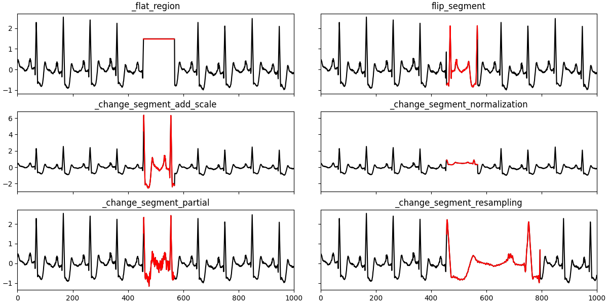

# TSB-AUD: An End-to-End Anomaly Detection Benchmark Suite for Univariate Time-Series Data

TSB-UAD is a new end-to-end benchmark suite to ease the
evaluation of time-series anomaly detection methods. Overall, TSBUAD
contains 12686 time series with labeled anomalies spanning
different domains with high variability of anomaly types, ratios,
and sizes. Specifically, TSB-UAD includes 10 previously proposed
datasets containing 900 time series from real-world data science applications.
Motivated by flaws in datasets and evaluation strategies,
we study anomaly types and data transformations to contribute
two auxiliary datasets. Specifically, we generate 958 time series
using a principled methodology for transforming 126 time-series
classification datasets into time series with labeled anomalies. In
addition, we present a set of data transformations with which we
introduce new anomalies in the public datasets, resulting in 10828
time series with varying difficulty for anomaly detection.


## Installation

This package works with Python 3.8 and pip 21. You need to have the following packages installed on the system.

```
pip install -r requirements.txt
```

Clone the repository

```
git clone https://github.com/yuhao12345/TSB-AD.git
```

Install locally

```
cd TSB-AD-main
pip install .
```

## Examples
* test_anomaly_detectors.ipynb : The performance of 10 popular anomaly detectors. 
* test_artificialConstruction.ipynb: The synthesized dataset based on anomaly construction. 
* test_transformer.ipynb: The effects of 11 transformations.
## Benchmark 
In ./data contains four folders: 

* benchmark/ contains ten public datasets. Below shows some typical outliers in these ten datasets.


* UCR2018-NEW/ contains 128 subfolders 

* artificial/ contains the data that are constructed based on UCR2018-NEW


* synthetic/ contains the data that are synthesized by local and global tranformations



## Anomaly Detector
We test ten algorithms in the module.

Below shows a result based on Autoencoder.

For each output figure, the left panel shows the real time series with outliers (red), anomaly score obtained by each anomaly detector, and the correpsonding TP/FP/TN/FN classification.

The right panel shows the ROC curve. AUC represents the area under the ROC curve. Larger AUC indicates better performance.


